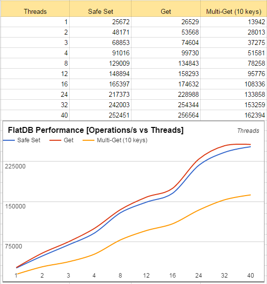
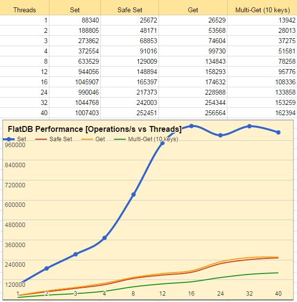

#FlatDB Benchmarks
Benchmark are done using PHP7, 2-250 byte items, 2xIntel(R) Xeon(R) CPU E5-2660 v3 @ 2.60GHz, Client and Server is on the same machine.
Generally it's recommended to issue set and getMulti operations as these are fastest as 2-way network communication is bottleneck that
is limiting throughput most of the time. So getting 10 keys one-by-one would require 20 network send/receive operations, while getting 10 keys in batch, only 2 network ops.

##Safe and Unsafe meaning
Safe operations are quaranteed to be executed, while for unsafe operations it's only guaranteed that the data was sent to FlatDB server.
This makes unsafe operations very fast as there's no need for 2 way communication, generally this is the way you should operate most of the time
while using FlatDB as cache, because if the data was properly set you can be certain that it was saved unless there's not enough memory on the server.

If there's not enough memory, the server will not set items, unlike memcached. If there's no room the item will get dropped, this will be reported only by safe operation (like add, or safe set).
In general there's rebalancer and garbage collector running, so if you have enough space to hold your items you won't run out of memory.

 
_Key set (unsafe) vs getMulti, getting value of 10 different, existing keys at a time._

##Basic safe operations##
Operations that use 2 way communication are benchmarked here.
 
_Safe operations, operations that are guaranteed to succeed on the server_

##Safe vs unsafe##
Below you can see difference in speed between operations that require 2 way communication, and set, which doesn't.
 
