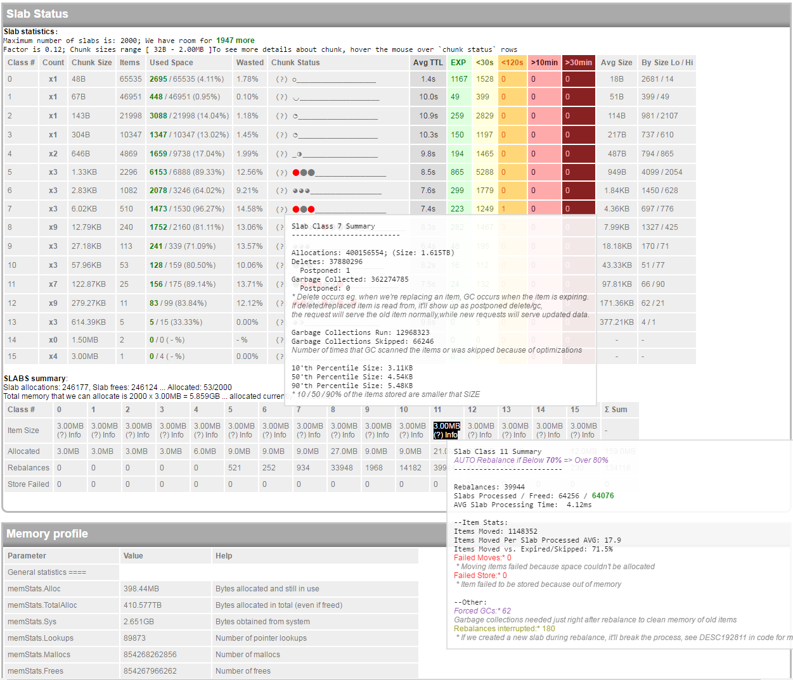
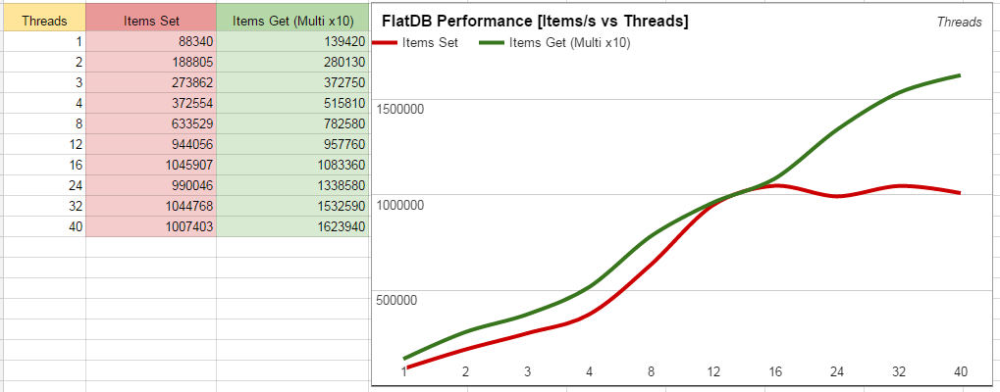

# FlatDB


FlatDB is modern memcached replacement, which is designed to be ideal for dynamic web applications. You can compile the server using scripts found in /bin directory, also precompiled server is available as "Release", please go to Release tab if you prefer to use precompiled version. PHP Client can be installed using composer.

&nbsp;
&nbsp;


FlatDB supports sharding and [replication...](REPLICATION.md)

Firstly it's written from scratch, taking modern hardware specifications into account, it's simple, has no legacy code such as ascii protocol support and has many features which are not supported or buggy in original memcached server.

It was created mainly to deal with limitations of memcached LRU algorithm and lack of properly working memcache**d** extension for PHP7 (working memcache extension is available, tho). It's based on [HSServer](https://github.com/slawomir-pryczek/HSServer) which is generic server implementation you can use to easily expose services written in golang over network.


<br>
_Benchmark using PHP7, 2-250 byte items, 2xIntel(R) Xeon(R) CPU E5-2660 v3 @ 2.60GHz, Client and Server on the same machine. Click to see more [Benchmarks](BENCHMARKS.md)_

#Server Deployment
You can deploy using just using ```./flatdb-linux64```, please remember to enable execution bit using chmod.
 
Production deployment with auto-restart
```
screen
cd ./bin
started=\`date +%Y%m%d@%H:%M\`; for i in {1..999999}; do ./flatdb-linux64 1>/dev/null 2>"error-$started-$i.log.txt"; sleep 10; done;
```

If everything went ok you should be able to see server's status page: http://127.0.0.1:7778/?action=server-status

# Client Library - Usage
For FlatDB php api you can [read documentation here](DOCUMENTATION.md)

For installing client libraries using composer please add following lines to your composer.json, you can also download manually, in such case you'll need to download php-client directories from both FlatDB and HSServer projects.
```json
{
  "repositories": [{"type": "git", "url": "https://github.com/slawomir-pryczek/FlatDB"},
    {"type": "git", "url": "https://github.com/slawomir-pryczek/HSServer"}],
  
  "require": {"FlatDB":"3.*"}
}
```

After this is done, you need to following command from cmd line
```php composer.phar install``` for help in composer installation, please follow this link https://getcomposer.org/download/

This code will connect to the server and read/set some keys, make sure port and ip adress are correct
```php
<?php
require __DIR__ . '/vendor/autoload.php';
use FlatDB\FlatDB;

FlatDB::addServer('192.168.10.1', '7777');

$fdb = new FlatDB();
$fdb->add('random 1', rand(1,99999), 5);
$fdb->set('random 2', rand(1,99999), 5);
echo $fdb->get('random 1').'<br>';
echo $fdb->get('random 2');
```

# Requirements
- PHP7 for the client
- golang 1.7 for compiling server
- 32 bit compilation is **not supported** and the server compiled for 32 bit enviroments will likely segfault because it won't be able to allocate continuous blocks of memory. 

## Main advantages
- Server is written using 100% golang, can be easily compiled on serveral operating system
- Native PHP Client, there's no extension required, you can just include everything required in your project manually or by using composer
- Support for TCP and UDP protocols. UDP can be used to send non-important and diagnostic data into server
- Supports HTTP for all operations, and comprehensive server status / statistics
- Automatic, optimal slab cleanup and rebalance, items are moved between slabs to optimize memory usage
- No LRU algorithm, items in slabs are pre-scanned so there is no problem with garbage occupying memory when item's time to live differs, you can keep items that have 2s and 2days timeout and all will be properly collected
- Compression settings that can be defined for IP ranges, you can compress items sent using WAN network, skip compression for localhost and limit compression for private network items.
- Tested in production, with billions of items and terabytes of processed data
- Keepalive and nodelay connections by default, allowing for much faster communication, especially on loopback interfaces on modern linux distributions that use high MTU
- Ability to save data snapshot to disk, using MVCC mechanism
- Real flush operation (items are deleted and slabs freed)
- New modern approach to atomic operations, insert-or-replace-with-CAS using PHP callbacks prevent data from being damaged during multithread modification
- Ability to get item TTL, increment / decrement operations which can, optionally set a new TTL
- Get first key from set operation, will return first available item from set of keys
- Peek operation, see which items are available without sending data
- Support for large items, and variable size SLABs
- Can be compiled under x64 Windows
