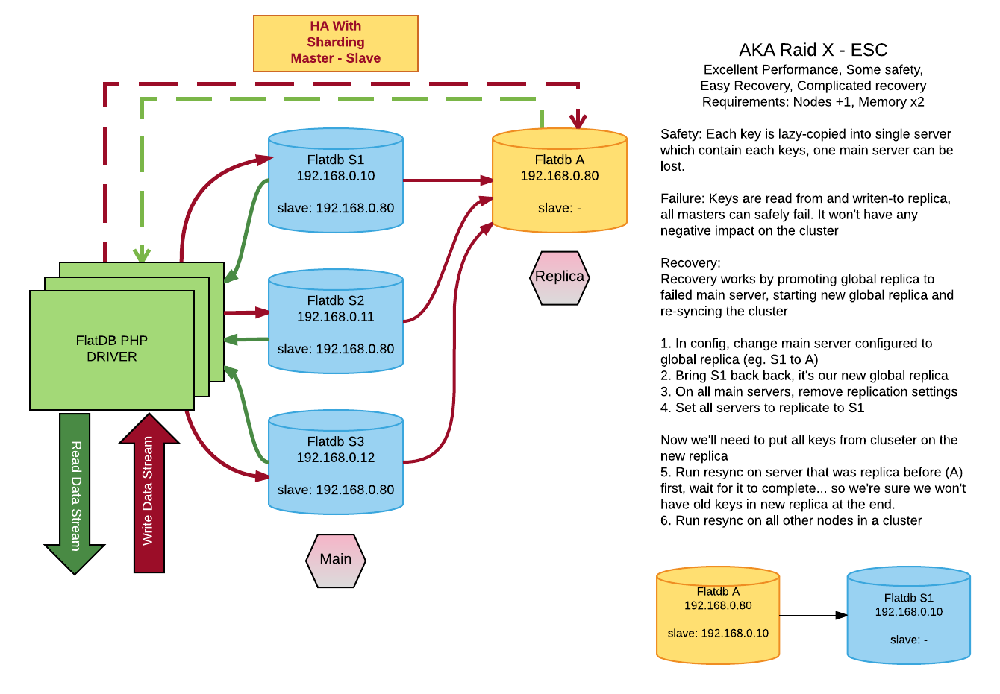
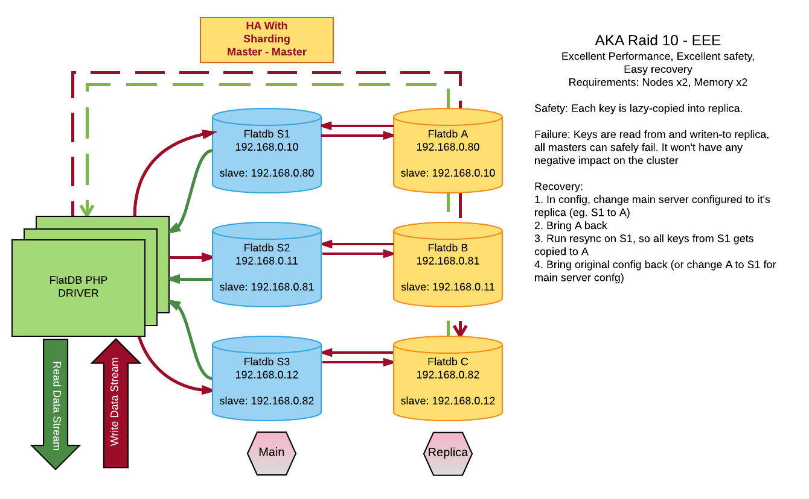
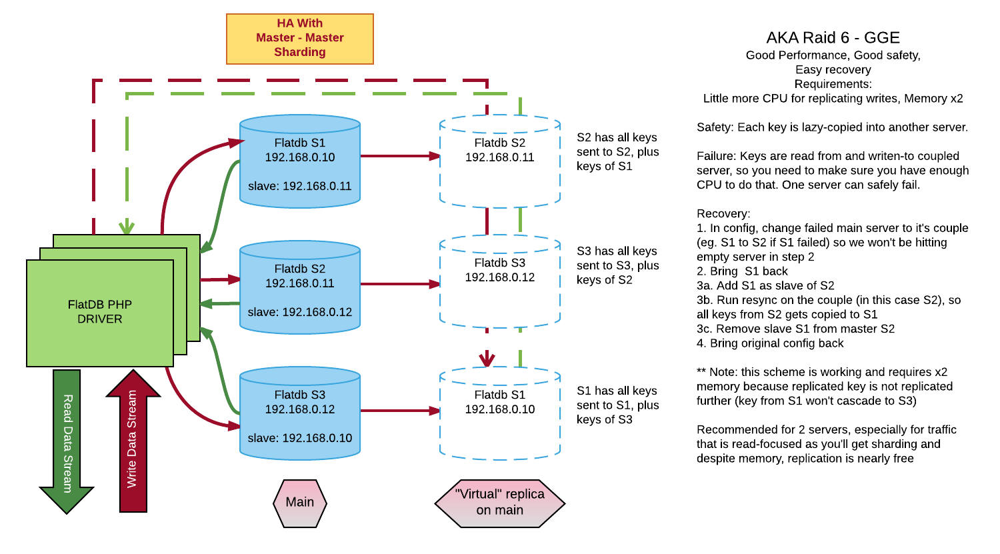

#Replication support
FlatDB supports both master-master and master-slave replication, which is lazy and eventualy consistent. Key stored on master is not guaranteed
to be stored on replica after the writing function returns. Instead, the replication works by dividing time into 100ms windows and sending aggregated, compressed changes
from this period to the slave, then replying it.

This mode of replication plays very well with sharding. To improve performance of the cluster you can create more nodes and use them as shards.
To have high-availablity you can use one of three replication models described later.

##Simple setup, just sharding
Servers are divided into groups, if you add >1 server into single group it'll form a sharded cluster. Keys will be distributed according to weight (10/5). 
You can define many groups. Sharded or not.
```php
FlatDB::addServer("192.168.10.1", "7777", 10, [group]);
FlatDB::addServer("192.168.10.2", "7777", 5, [group]);
...
$fdb = new FlatDB([group]);
```

Same thing can be acomplished using FlatDBCluster, you can leave **replicas** empty to define cluster without replication.
```php
FlatDBCluster::addServers(["192.168.10.1:7777:10", "192.168.10.2:7777:5"], [replicas], [group]);
...
$fdb = new FlatDBCluster([group]);
```

For creating replicated cluster, you need to use second parameter of addServers, number of replicas doesn't need to match number of main servers. In example below, each server has it's own replica. If you're using different weights **make sure** they're matching if you want keys from first server to be looked in first replica.
```php
FlatDB::addServers(["192.168.10.1:7777:10", "192.168.10.2:7777:5"], ["192.168.10.101:7777:10", "192.168.10.102:7777:5"], [group]);
...
$fdb = new FlatDB([group]);
```
**NOTE:** This is just how the driver will look for the keys, it doesn't affect anything else(!). You need to also properly setup the server config within the cluster to be able to use replication in PHP. For sharding, it's done by PHP Driver alone... so if you want just sharding - nothing more to do.

##Configuring slave
To configure slave you'll need to edit master's conf.json to add "SLAVE":"127.0.0.1:7777,..." you can define more than one slave(s) by specifying more than one servers and 
using comma as separator. You can also specify replication mode, using "REPLICATION_MODE":"SAFE", there are 2 modes available:
 * OPTIMISTIC (default) - will minimize network usage eg. by sending touch as touch commands
 * SAFE - will also send item's content alongside for operations that don't require it (eg. touch), if your slave is low on memory this can help keeping data in better shape

###Replication modes
There are several modes available, you can also have your own, or mix recommended models...

####Raid-X
This mode provides good perofmance, safety and requires one additional server. It'll put no additional stress on main servers, however one server is required that's able to keep all the shards. After configuring individual nodes according to the graphic, to access it from PHP you'll need following code

```php
FlatDB::addServers(["192.168.0.10:7777:10", "192.168.0.11:7777", "192.168.0.12:7777"], ["192.168.0.80:7777"]);
...
$fdb = new FlatDBCluster();
```



You can also use variation of this model, eg. one replica for each 2 main servers, sample code is below. Make sure that if you're defining replicas, we always want to have exactly same number of replicas defined, in PHP, as number of main servers so we know where the keys will land if main server is down.
```php
FlatDB::addServers(["192.168.0.10:7777:10", "192.168.0.11:7777", "192.168.0.12:7777", "192.168.0.13:7777"],
  ["192.168.0.80:7777", "192.168.0.80:7777", "192.168.0.81:7777", "192.168.0.81:7777"]);
...
$fdb = new FlatDBCluster();
```
####Raid-10
This is eassentially Raid X, that has same number of replicas as main servers, and where you can setup master-master replication between nodes to make recovery simpler. The only downside is, that it'll require twice as much servers. However as replicas use almost no CPU you could consider setting up replicas on same servers as master nodes, if you have enough memory (eg. S1 and B on server 1, S2 and C on server 2, S3 and A on server 3, etc.)
```php
FlatDB::addServers(["192.168.0.10:7777:10", "192.168.0.11:7777", "192.168.0.12:7777"],
  ["192.168.0.80:7777", "192.168.0.81:7777", "192.168.0.82:7777"]);
...
$fdb = new FlatDBCluster();
```



####Raid-6
This mode will require very little resources to provide replication, basically keys are stored on another node that's used in production. This is possible because keys are sharded by CRC and key X will always land on same node, and replication is not cascading (replication task(s) are just issued by slave ONCE, not forwarded to other replicas). Recovery is easy but will require to dynamically change the cluster layout for some time.

For generating PHP code, it's easier than it looks like, you just copy main server list to replicas, and then in replicas, you cut first element of array and place it at the end.


```php
FlatDB::addServers(["192.168.0.10:7777:10", "192.168.0.11", "192.168.0.12"],
  ["192.168.0.81:7777", "192.168.0.82:7777", "192.168.0.80:7777"]);
...
$fdb = new FlatDBCluster();
```
